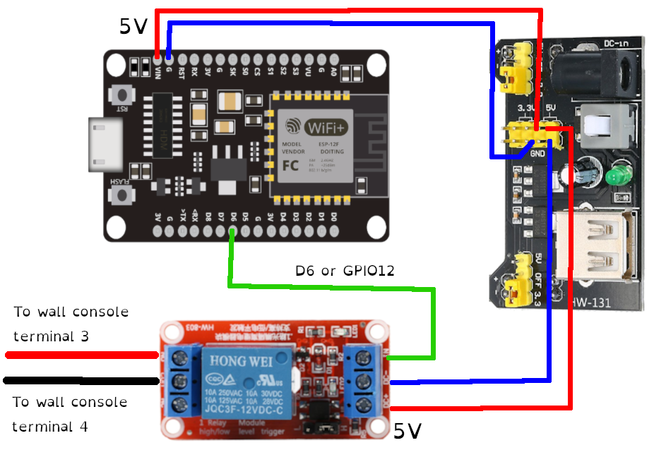

# Garage control

The purpose of this project was to make my garage door button smart so I could control it remotely with Home Assistant.

This project involves:

- Configuring the default Home Assistant MQTT broker.
- Assembling a circuit using an ESP8266 module, an HW-803 relay, an HW-131 power supply and a 12V power adapter.
- Writing some C code in the Arduino app.
- Creating a button in your Home Assistant dashboard.

## The finished product

The circuit is contained in a transparent box that I screwed to the ceiling of my garage, with the cables of the relay connected directly to the same sockets where the garage door button is connected.


## The MQTT broker

I initially tried using a cloud MQTT broker (HiveMQ) but I ran into several issues. I was wasting a lot of time trying to figure out the certificate handling. But then I realized I didn't need a cloud solution because I could just have an MQTT broker in my local network, which meant that it would be more secure as only Home Assistant and my modules connected to my home WiFi would have access to it. So best option was to install the MQTT integration for Home Assistant and the Mosquitto Broker add-on.

Instructions:

- Go to Settings -> Devices & Services -> Add integration.
- Search for [MQTT](https://www.home-assistant.io/integrations/mqtt) and install using the default configuration (no need to do any customization).
- Go to Settings -> Add-ons -> Add-on store.
- Find [Mosquitto Broker](https://github.com/home-assistant/addons/tree/master/mosquitto) and install it.
- Once installed, enable "Start on boot" and "Watchdog".
- Now go to Settings -> People -> Users -> Click on the "Add user" button. Give it a display name, a username and a password of your choice.
- Finally, go back to Settings -> Devices & Services. Click on the installed "MQTT" integration, then click on the "Configure" button, and then in the "Re-configure MQTT" button. The only two elements you need to change here are the username and password that you chose in the previous step. Leave everything else untouched. Click Next, also leave everything untouched in this second window, and finally click Submit.

You'll be brought back to the "MQTT Settings" page. Here you can test that it works:

- Scroll down to "Listen to a topic".
- In the "Topic to subscribe to", type "/homeassistant/mytest", then press Enter to enable the "Start listening" button, then click that button.
- Scroll back up to "Publish a packet". In the "Topic" textbox, type "/homeassistant/mytest". In the "Payload" textbox, type "Hello world", then click on the "Publish" button.
- Scroll back down to "Listen to a topic" and you'll see a new list added to the bottom with all the listened message. In this case, you'll see a list item saying:

```
Message 0 received on "/homeassistant/mytest" at `<timestamp>`:
Hello world
```

You can keep publishing more messages and they'll get appended to that list.

The Broker is now ready to use.


## The circuit

To be able to open my garage door, I decided to use an ESP8266 module connected to a HW-803 relay via the D6 (or GPIO12) pin.

From the relay I connected NO (normally open) to the garage door's wall console terminal 3, and COM (common) to the wall console terminal 4.

Those two wall console terminals are connected to the wall button. The way they're connected makes a led be permanently turned on in the button itself so it can be seen in the dark. This means that circuit is NC (normally closed). In order to make the circuit work, I had to switch those two cables in the console terminal to make them NO (normally open). The two cables from the relay share the terminals with the original cables.

Both the ESP8266 and HW-803 modules are connected to the 5V and GND pins from the HW-131 power supply module.

Finally, the HW-131 is connected to the wall power outlet using a 12V power adapter.



## The Arduino IDE configuration

You need some special configuration in your Arduino IDE to ensure you can compile and upload your MQTT code to an ESP8266:

- Go to File -> Preferences. In the "Additional Board Manager URLs" textbox, paste the URL: `https://arduino.esp8266.com/stable/package_esp8266com_index.json` then press OK.
- Go to Tools -> Manage Libraries.
- Search for and install "PubSubClient" by Nick O'Leary. This library lets you send and receive MQTT messages to and from any MQTT broker.
- Go to Tools -> Board -> ESP8266 Boards. Depending on the model of ESP8266 module that you bought, you have to choose "NodeMCU 0.9 (ESP-12 module)", "Generic ESP8266 Module", or maybe other. In my case, I chose the first one.

## The code

Here's the template I used for my Arduino project: [garage_control.ino](garage_control.ino)

Things to note:

- The pin's name matches the label in the ESP8266, but the value is the GPIO number.
- The `mqtt_username` and `mqtt_password` char arrays represent the values that were specified when configuring the Mosquitto broker.
- I used `/homeassistant/garage/trigger` as the topic that the module would subscribe to.
- The callback method only reacts to receiving the single character 'g'. Anything else gets ignored.

You can confirm that the device works by following two verification steps:

### 1) Upload the code to the ESP8266

- Open the Arduino IDE. Make sure you configured the IDE with the steps described in the previous section.
- Open the garage_control.ino file.
- Modify the variables at the top to adapt the circuit to your needs:
  - Wifi username and password
  - MQTT username and password
  - IP of the broker
  - Port of the broker
- Connect the circuit to your laptop via USB.
- Go to Tools -> Serial Monitor (or press Control+Shift+M). Change the BAUD rate to 115200. Keep the window open.
- Go back to the main window, then compile the code and upload it to the ESP8266 module.
- When the code is uploaded, switch back to the Serial Monitor window and confirm that the module was able to connect to wifi and connect to the MQTT broker.

### 2) Confirm it's online

- Keep your circuit connected and the Arduino IDE's Serial Monitor window open.
- Now switch to Home Assistant and go to Settings -> Devices & Services -> MQTT -> Configure.
- Scroll down to "Listen to a topic" and type the topic "/homeassistant/garage/ack". Click on the "Start listening" button. This is the topic into which the ESP8266 will publish the string 'online' whenever it gets pinged.
- Scroll back up to "Publish a packet". Type the topic "/homeassistant/garage/ping". You can empty the "Payload" textbox. Press the "Publish" button.
- If your circuit connected to wifi and subscribed to the 'ping' topic as expected, it should publish a message to the 'ack' topic and Home Assistant listener should show that message at the bottom.

### 3) Confirm it can trigger the relay

- Again go to Home Assistant's Settings -> Devices & Services -> MQTT -> Configure window.
- In the "Publish a packet" section, type the topic "home assistant/garage/trigger". Set the letter 'g' as payload. Press "Publish".
- If the circuit is correctly connected, the relay should make a click noise, then one second later it should make another click noise. This means the circuit was closed then opened again successfully.

## The Home Assistant configuration

The final step is to create a Home Assistant button to toggle open/close the garage door.

- In the Home Assistant main page, go to your favorite dashboard and click on the "Edit dashboard" (pencil) button on the top right.
- Click on the "Add card" button on the bottom right.
- Select "Button".
- Visually you can configure it by:
  - Emptying the "Entity" textbox.
  - Setting a name and choosing an icon. I chose "Garage door" and "mdi:garage".
  - Enabling "Show name" and "Show icon".
  - Empty "Icon height" and "Theme".
  - Tap behavior: "Perform action".
  - Action: "mqtt: Publish".
  - Topic: "/homeassistant/garage/trigger".
  - Payload: "g".
  - Scroll down and hit Save.
- Alternatively, you can press the "Show code editor" button on the bottom left of the modal window and paste this yaml:

```yaml
show_name: true
show_icon: true
name: Garage door
type: button
tap_action:
  action: call-service
  service: mqtt.publish
  service_data:
    topic: /homeassistant/garage/trigger
    payload: g
icon: mdi:garage
```

## Sources

- [Getting Started with MQTT on Arduino Using NodeMCU ESP8266](https://www.hivemq.com/blog/mqtt-on-arduino-nodemcu-esp8266-hivemq-cloud/)
- [Mosquitto Broker for Home Assistant](https://github.com/home-assistant/addons/tree/master/mosquitto)
- [MQTT integration for Home Assistant](https://www.home-assistant.io/integrations/mqtt)
- [HW-131 power supply module](https://www.amazon.ca/Mini-Power-Supply-Module-HW-131/dp/B0813KQ23P)
- [HW-803 relay module](https://www.amazon.ca/Optocoupler-Isolation-Support-Trigger-Expansion/dp/B07TXMC26L)
- [ESP8266 module](https://www.amazon.ca/KeeYees-Internet-Development-Wireless-Compatible/dp/B07PR9T5R5)
- [PubSubClient library for MQTT communication](https://github.com/knolleary/pubsubclient)
- [WiFiClient class for WiFi connections](https://github.com/esp8266/Arduino/blob/master/libraries/ESP8266WiFi/src/WiFiClient.h)
- [Home Assistant MQTT button](https://www.home-assistant.io/integrations/button.mqtt/)
- [HA Community: Create a button to publish to mqtt](https://community.home-assistant.io/t/create-a-button-to-publish-to-mqtt/239077)
- [HA Community: Custom button to mqtt publish upon click](https://community.home-assistant.io/t/custom-button-to-mqtt-publish-upon-click/563659)