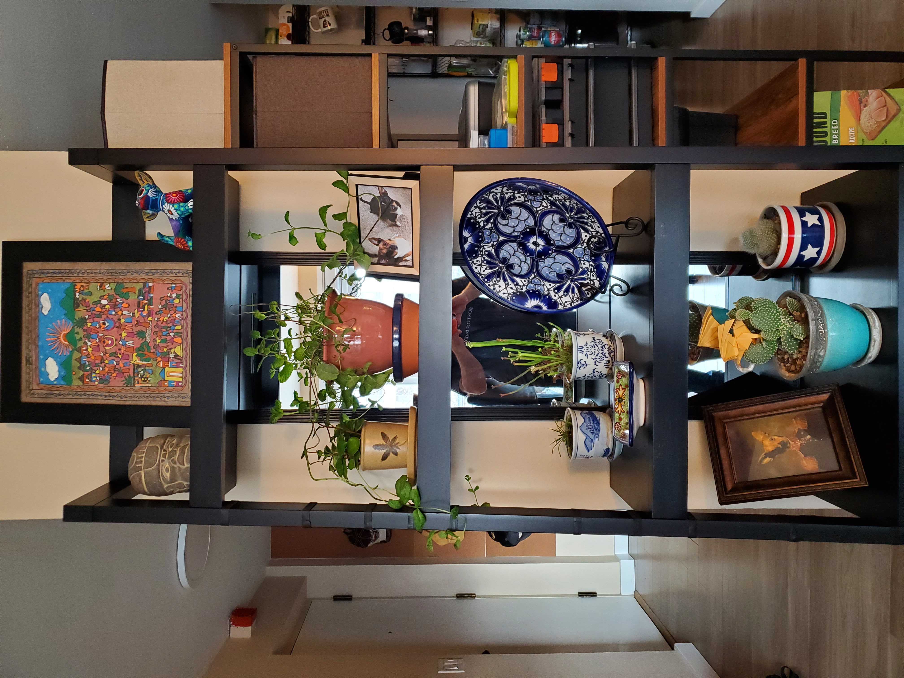
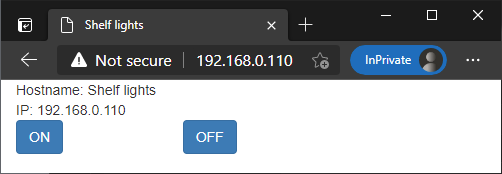
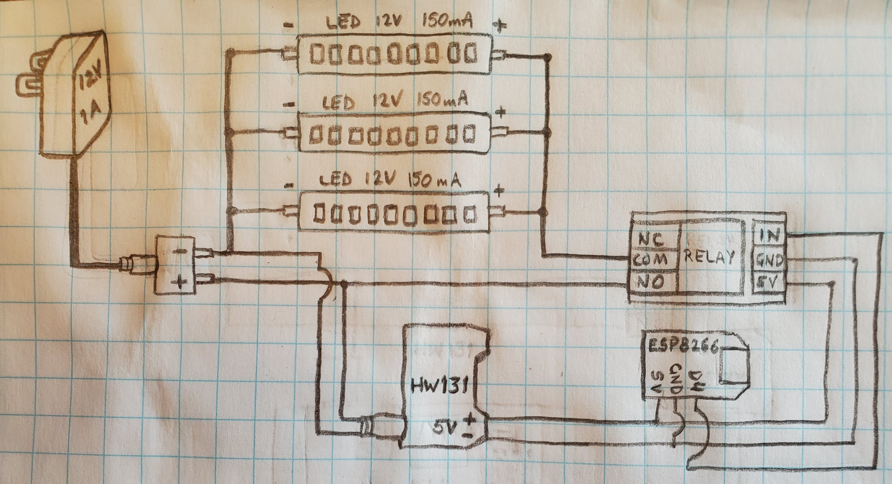

# Shelf lights

The purpose of this project is to add LED lights to a bookshelf, and be able to turn them off or on remotely.

## The finished product

I added 4 LED strips to my bookshelf:

- One on the top, facing up, to light a portrait.
- Three on the ceiling of the top 3 shelves. I ommited the bottom one.

| Lights off | Lights on |
|-|-|
|||

The lights can be turned off or on through a webpage in the local network.

The page looks like this:

 |

## The circuit

Here are all the items I used for the circuit:

- The circuit is powered using a wall plug: [12V power supply adapter](https://smile.amazon.com/gp/product/B00FEOB4EI/ref=ppx_yo_dt_b_search_asin_title?ie=UTF8&psc=1). 
- The wall plug provides 12V of DC power to the circuit, which is fed to the circuit via a PCB barrel jack: [PCB mounting female DC power barrel jack](https://smile.amazon.com/gp/product/B074LK7G86/ref=ppx_yo_dt_b_search_asin_image?ie=UTF8&psc=1).
- I use 4 LED strips, connected in parallel, that need to be _indirectly_ fed with the 12V coming from the power plug (the relay decides when power will be provided to the LEDs): [White ultra bright LED strips](https://vetco.net/products/white-12v-cob-led-strip-with-adhesive-2-pack/vetcob1).
- In the same parallel circuit as the LEDs, I connect a 12V to 5V converter, so I can power the relay and the Arduino module: [12V to 5V power supply module](https://smile.amazon.com/gp/product/B00HJ6AE72/ref=ppx_yo_dt_b_asin_title_o03_s01?ie=UTF8&psc=1).
- The ESP8266 Arduino module has WiFi capabilities, which controls the relay via the D4 pin: [IZOKEE ESP8266 ESP-12F Arduino WiFi board](https://smile.amazon.com/gp/product/B076F52NQD/ref=ppx_yo_dt_b_search_asin_title?ie=UTF8&psc=1).
- The relay is turned off by default (Normally-Open), and when the ESP8266 D4 pin is turned on, the Relay circuit is closed and the LED lights get powered: [HW-803 5V relay module](https://www.aliexpress.com/i/33044828528.html).

The drawing only shows 3 LED strips but in reality my circuit had 4. You may be able to add more LED strips in parallel, but keep in mind that the current will be divided and the light will be dimmer.

## The code

The Arduino model I'm using is an IZOKEE ESP8266 ESP-12F, which is not supported by the Arduino IDE out of the box. To use it, you need to:

- Go to File -> Preferences -> Additional Board Manager URLs -> Paste this URL: https://arduino.esp8266.com/stable/package_esp8266com_index.json -> Press OK.
- Go to Tools -> Boards -> Board manager -> Search for "esp8266" -> Install the latest version.
- Go to Tools -> Boards -> ESP8266 Boards -> Select "WeMos D1 R1".
- Now you can compile the code and upload it to the board.

The ESP8266 module has a very simple webpage, which shows On and Off Bootstrap-decorated buttons, to toggle the state of pin D4.

In the source code, I left all the D* pin values, in case you prefer to change the pin you want to use.

Before uploading the code, make sure to set the values of the Wifi SSID, password, and optionally, the hostname.

Code file: [curtain.ino](curtain.ino)