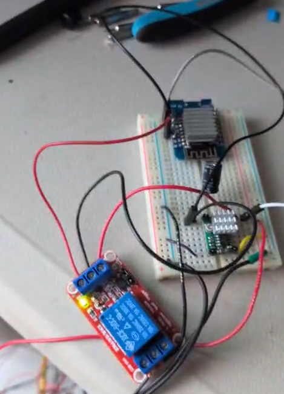
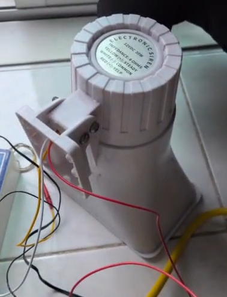
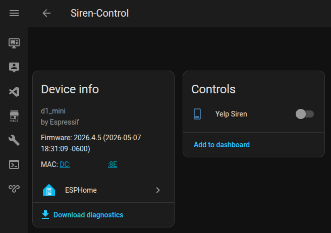
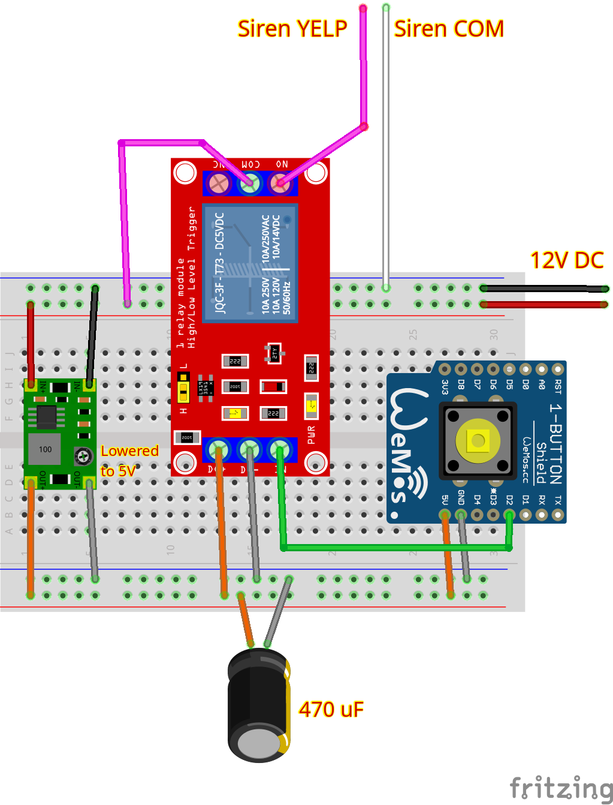

# Siren

The purpose of this project is to make a siren that is controllable from Home Assistant.

This project involves:

- Assembling a circuit.
- Writing some ESPHOME Yaml code.
- Detecting the ESPHOME device in Home Assistant.

## The finished product

Breadboard:



Siren:



Home Assistant:



## The siren

The siren is a 12V DC / 30W / 8 Ohm electronic unit. It draws around 2.5A while playing. It has three wires:

- **Red (+)**: when powered against the White wire, the siren plays a fast oscillating warble ("Yelp" tone).
- **Yellow (+)**: when powered against the White wire, the siren plays a continuous single-tone wail ("Steady" tone).
- **White (−)**: shared ground for both tones.

Only one tone should be played at a time.

## The circuit

Modules:

- Wemos D1 Mini (ESP8266) module
- Either a 1-channel, or two 1-channel, or one 2-channel relay module (only one channel is required initially, the second is optional).
- An adjustable 12V to 5V buck converter module.
- A bulk electrolytic capacitor (470 µF–1000 µF).
- A 12V DC power adapter.
- The 12V DC siren.

To control the siren, the D1 Mini controls one or both channels of the relay module. The first relay (Yelp) is required; the second relay (Steady) is optional and can be added later to have both tones available.

The 12V DC power adapter powers two things:

- The siren (COM and YELP indirectly, cut by the Relay).
- The buck converter (IN- and IN+).

The buck converter needs to have its potentiomenter rotated until OUT- and OUT+ yield 5V.

The OUT+ and OUT- pins of the buck converted should be connected in parallel to the Wemos D1 mini 5V and ground pins, as well as the Relay's 5V and ground pins. If the second optional relay is added, it should also be connected in parallel.

The relay's IN pin should be connected to the Wemos D2 (Yelp). The second optional IN pin can be connected to D1.

The capacitor should be connected to the OUT- and OUT+ pins of the buck converter to ensure that when the relay(s) are turned on, they don't deplete power for the Wemos.

Finally, the YELP 12V cable should be split so the end that comes from the siren is connected to the first relay's COM, and the second cable is connected from NO (Normally Open) to the 12V DC output of the power adapter.

Similarly, if STEADY is used, then the siren's STEADY cable should be connected to the second relay's COM, then another cable should go from NO (Normally Open) to the 12V DC output of the power adapter.



## The code

Here's the template used for this Arduino project: [siren.yaml](siren.yaml)

The secrets are stored in the root folder of this repo so they get imported indirectly vias the [secrets.yaml](secrets.yaml) file from this subfolder. That file contains the IP address of Home Assistant, the WIFI SSID and the WIFI password. Note that the WIFI should be the same network where Home Assistant is connected.

The yaml code enables one GPIO pin: D2, which controls Yelp.

IMPORTANT NOTE: This code won't enforce playing only one siren sound at a time if a second pin is added. To ensure only one gets played, the buttons should be changed to a radio button that chooses OFF, YELP or STEADY.

## Compiling and uploading

To install the esphome compiler and uploader, create a Python virtual environment in the root folder of this repo and then load it:

```
cd $REPOS/Electronics
python -m venv venv
source venv/bin/activate
```

Install esphome via pip:

```
pip install esphome
```

Connect via USB your esp32 device, then run the command:

```
esphome run siren/siren.yaml
```

The program will ask you to confirm how to upload the code. Select the USB option, it should've detected your connected ESP32 device automatically.

## Home Assistant

Unplug the USB from your ESP32 device. Connect the power adapter to the power grid, wait a few seconds for the ESP32 to connect to your wifi.

Go to Settings -> Devices and Services -> Your ESPHOME device will be automatically detected by Home Assistant. Add it. You'll see two buttons, one for Yelp, another for Steady.
